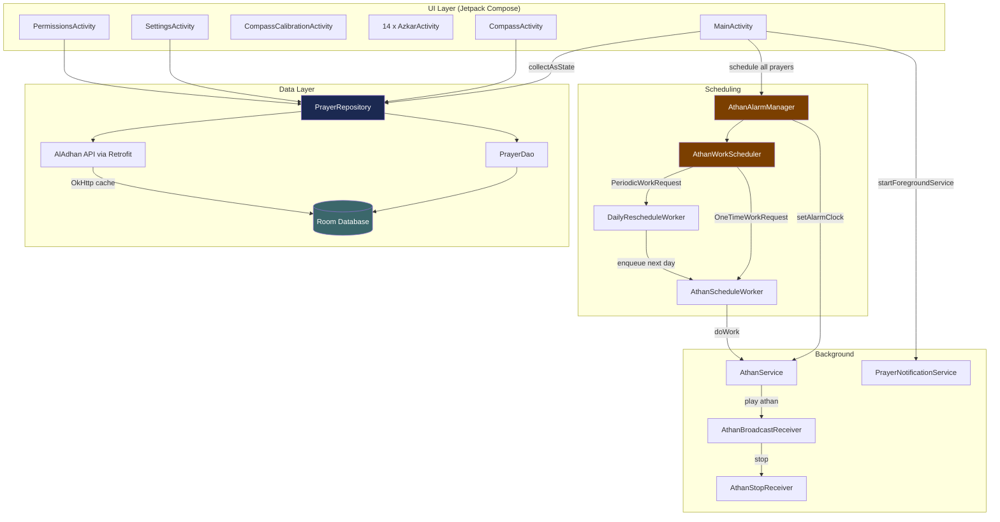
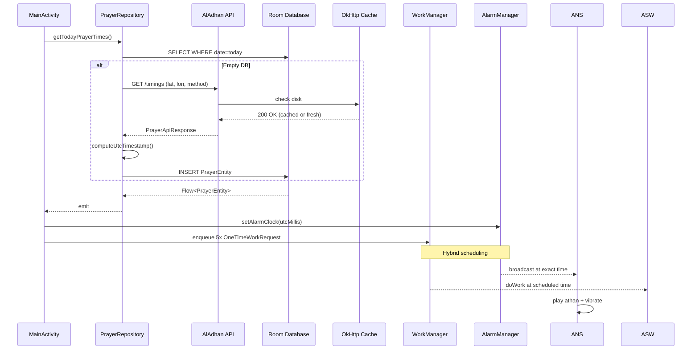
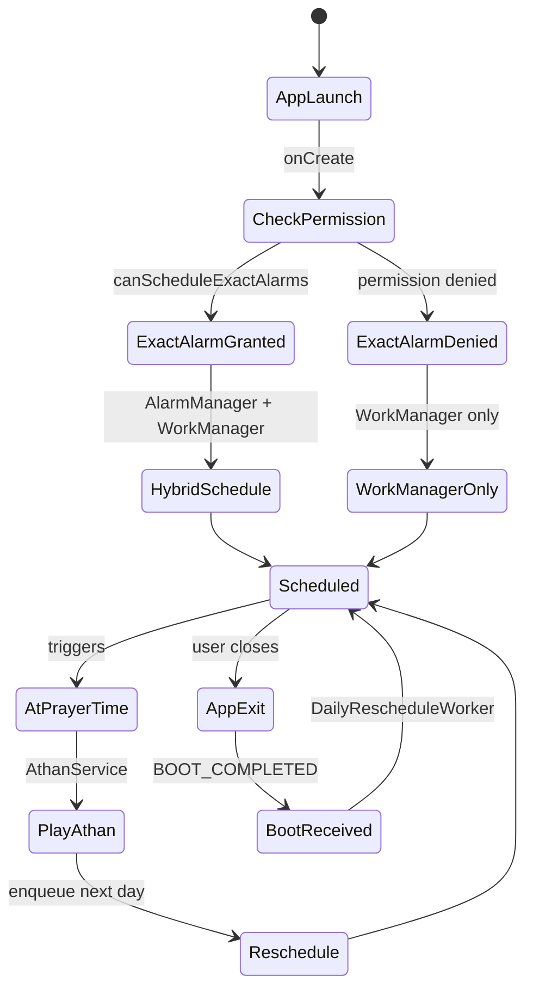

# Mesk — Islamic Prayer Times

An Android application for daily prayer times, Qibla direction, and Islamic remembrances (Athkar). Built with Kotlin and Jetpack Compose, it combines accurate astronomical calculations with a reliable background scheduling system that survives device reboots, Doze mode, and missing exact-alarm permissions.

---

## Overview

Mesk computes prayer times from your geographic coordinates using the AlAdhan API, stores them locally in Room, and surfaces them through a Compose-based home screen. A persistent notification shows time-until-next-prayer at all times. At each prayer's scheduled time, the app plays an Athan (call to prayer) using a hybrid AlarmManager + WorkManager scheduler. The Qibla compass uses device sensors with a figure-8 calibration flow for accuracy. The Athkar module provides categorized remembrances across fourteen activities.

The scheduling design deserves emphasis: WorkManager is the primary scheduler because it requires no special permission and survives aggressive battery optimization. AlarmManager is layered on top as an optional precision enhancement when `SCHEDULE_EXACT_ALARM` is granted. If permission is denied, WorkManager still fires the Athan on time.

---

## Features

- Daily prayer times (Fajr, Dhuhr, Asr, Maghrib, Isha) with 12-hour localized display
- Persistent countdown notification updated every minute
- Full-screen Athan playback with vibration, dismissible from notification or lock screen
- Qibla compass with shortest-path needle rotation and figure-8 calibration
- Fourteen categorized Athkar activities (morning, evening, sleep, food, travel, illness, and more)
- Offline access to previously fetched prayer times via OkHttp disk cache
- DST-immune time storage using IANA timezone IDs and UTC epoch millis
- Background rescheduling survives reboot, Doze, and app process death

---

## Architecture

The app follows a layered MVVM pattern with a single source of truth (Room) and a unidirectional data flow from the API to the UI.

### High-Level System



### Data Flow



### Scheduling Strategy



### Module Layout

```
app/src/main/java/com/example/masjd2/
├── MainActivity.kt              Home screen, prayer cards, navigation
├── CompassActivity.kt           Qibla direction with sensor fusion
├── CompassCalibrationActivity.kt Figure-8 calibration flow
│
├── ui/
│   ├── CheckingActivity.kt       First-run location + method picker
│   ├── DownloadProgressActivity.kt Initial API fetch progress
│   ├── FirstLaunchActivity.kt    Onboarding entry
│   ├── PermissionsActivity.kt    Runtime permission requests
│   ├── SettingsActivity.kt       Athan toggle, volume, calculation method
│   └── theme/                    Material 3 color, typography, shapes
│
├── data/
│   ├── api/
│   │   ├── PrayerApiService.kt   Retrofit interface
│   │   ├── PrayerApiModels.kt    DTOs and response mapping
│   │   └── RetrofitClient.kt     OkHttp client with 10MB disk cache
│   └── db/
│       ├── PrayerDatabase.kt     Room database
│       ├── PrayerDao.kt          Reactive Flow queries
│       └── PrayerEntity.kt       UTC epoch + IANA timezone
│
├── repository/
│   └── PrayerRepository.kt       Single source of truth, DST handling
│
├── services/
│   ├── AthanService.kt           Foreground audio playback
│   ├── PrayerNotificationService.kt Persistent countdown (1-min updates)
│   ├── AthanAlarmManager.kt      Hybrid AlarmManager + WorkManager
│   ├── AthanWorkScheduler.kt     WorkManager enqueue coordinator
│   ├── AthanScheduleWorker.kt    Per-prayer OneTimeWorkRequest
│   └── DailyRescheduleWorker.kt  24h PeriodicWorkRequest
│
├── receivers/
│   ├── AthanBroadcastReceiver.kt Fires AthanService from AlarmManager
│   └── AthanStopReceiver.kt      Stops foreground service on dismiss
│
├── AzkarActivity.kt              Azkar category menu
├── MorningAzkarActivity.kt
├── EveningAzkarActivity.kt
├── SleepAzkarActivity.kt
├── FoodAzkarActivity.kt
├── TravelAzkarActivity.kt
├── IllnessAzkarActivity.kt
├── FearAzkarActivity.kt
├── SorrowAzkarActivity.kt
├── JoyAzkarActivity.kt
├── RainAzkarActivity.kt
├── HomeAzkarActivity.kt
├── BathroomAzkarActivity.kt
├── AfterPrayerAzkarActivity.kt
├── ComprehensiveAzkarActivity.kt
└── AzkarItem.kt                  Azkar data model
```

---

## Key Design Decisions

UTC epoch storage. Prayer times are stored as UTC milliseconds internally (`fajrUtc`, `dhuhrUtc`, etc.) alongside the IANA timezone ID. This makes the system immune to DST transitions — when clocks spring forward or fall back, the next prayer's UTC instant remains correct. Local display strings (12-hour with AM/PM) are computed at render time from the stored UTC value and the device's current timezone.

Hybrid scheduling. WorkManager is the primary scheduler because it requires no special runtime permission, survives Doze mode, and reschedules itself across reboots. AlarmManager with `setAlarmClock()` is layered on top when the user grants `SCHEDULE_EXACT_ALARM`, providing second-level precision for the Athan. When the permission is denied, WorkManager still fires within a 1-2 minute window, which is acceptable for prayer time notification.

Repository as single source of truth. The UI never reads from the API or the network directly. `PrayerRepository` exposes `Flow<PrayerEntity>` from Room, fetches from AlAdhan on cache miss, and computes UTC timestamps from the API's local-time response. The Compose UI subscribes via `collectAsState` and re-renders automatically on data change.

Offline-first caching. OkHttp's disk cache (10 MB, 7-day stale tolerance) is configured in `RetrofitClient`. Previously fetched prayer times are available without internet — the repository returns cached Room data immediately, and only triggers an API call if the database has no entry for today.

Adaptive icons and legacy fallback. The launcher uses `mipmap-anydpi-v26/ic_launcher.xml` for adaptive icons on Android 8.0+ and density-specific PNGs (`mipmap-{m,h,xh,xxh,xxxh}dpi/ic_launcher.png`) for Android 7.0. Both code paths reference the same source asset, so the icon stays consistent across API levels and launcher implementations (including those that ignore adaptive icons).

---

## Tech Stack

| Layer | Technology |
|---|---|
| Language | Kotlin |
| UI | Jetpack Compose, Material 3 |
| Database | Room (reactive Flow queries) |
| Networking | Retrofit 2, OkHttp 4 (with disk cache) |
| Background | WorkManager 2.9, AlarmManager |
| Location | Google Play Services Location |
| Time | java.time (desugared for API 24-25) |
| Concurrency | Kotlin Coroutines |
| Testing | JUnit 4, MockK, kotlinx-coroutines-test |

---

## Project Structure

```
Mesk v2/
├── app/
│   ├── build.gradle              App module config (deps, desugaring, WorkManager)
│   ├── proguard-rules.pro
│   └── src/
│       ├── main/
│       │   ├── AndroidManifest.xml
│       │   ├── java/com/example/masjd2/   (see Module Layout above)
│       │   └── res/
│       │       ├── drawable/               Backgrounds, prayer card art, icons
│       │       ├── mipmap-*/               Launcher icons (adaptive + legacy)
│       │       ├── values/                 Strings, colors, themes
│       │       └── xml/                    FileProvider, backup rules
│       └── test/                           Unit tests (PrayerTime, QiblaDirection)
├── gradle/                      Gradle wrapper
├── gradle.properties
├── build.gradle                  Root project config
├── settings.gradle
├── gradlew, gradlew.bat
├── LICENSE                       MIT
├── GITHUB_SETUP.md               Deployment notes
└── README.md                     This file
```

---

## Requirements

- Android 7.0 (API 24) or higher
- Internet connection for initial data fetch
- Location permission for accurate prayer times
- Foreground service permission (API 28+) for Athan playback
- `POST_NOTIFICATIONS` permission (API 33+) for countdown notification
- `SCHEDULE_EXACT_ALARM` permission (API 31+, optional — falls back to WorkManager)

---

## Build

```bash
# Debug APK
./gradlew assembleDebug
# Output: app/build/outputs/apk/debug/app-debug.apk

# Release APK (unsigned)
./gradlew assembleRelease
# Output: app/build/outputs/apk/release/app-release-unsigned.apk
```

For release builds, generate a keystore and configure signing in `app/build.gradle`. See the Android documentation for details.

---

## Install

```bash
# Via ADB
adb install app/build/outputs/apk/debug/app-debug.apk

# Or transfer the APK to the device and tap to install
```

---

## Permissions Explained

| Permission | Required | Purpose |
|---|---|---|
| `INTERNET` | Yes | Fetch prayer times from AlAdhan API |
| `ACCESS_FINE_LOCATION` | Yes | Compute prayer times for your coordinates |
| `ACCESS_COARSE_LOCATION` | Yes | Fallback when fine location unavailable |
| `POST_NOTIFICATIONS` | API 33+ | Show persistent countdown notification |
| `FOREGROUND_SERVICE` | API 28+ | Play Athan in background |
| `FOREGROUND_SERVICE_SPECIAL_USE` | API 34+ | Required for Athan playback classification |
| `RECEIVE_BOOT_COMPLETED` | Yes | Reschedule alarms after device reboot |
| `SCHEDULE_EXACT_ALARM` | API 31+ | Optional — precise Athan timing |
| `USE_BIOMETRIC` / `USE_FINGERPRINT` | No | Reserved for future settings lock |
| `VIBRATE` | Yes | Athan vibration alert |

---

## Testing

Unit tests cover two areas that must remain correct across refactors:

- **QiblaDirectionTest** — bearing calculation from Cairo, Mecca, North Pole, equator, and 360° coverage. Validates the spherical-law-of-cosines implementation.
- **PrayerTimeTest** — 12-to-24-hour conversion, UTC timestamp computation across DST transitions, time ordering (Fajr < Dhuhr < Asr < Maghrib < Isha).

```bash
./gradlew test
```

---

## Contributing

Pull requests are welcome. For substantial changes, open an issue first to discuss the design. The codebase has no strict style guide, but follows standard Kotlin conventions and the existing patterns in the repository.

---

## License

This project is licensed under the MIT License. See the [LICENSE](LICENSE) file for details.

---

## Acknowledgments

Prayer time calculations are provided by the [AlAdhan API](https://aladhan.com/prayer-times-api). The Qibla direction uses the great-circle bearing from the user's coordinates to the Kaaba in Mecca. Athkar content is sourced from authentic hadith collections.
